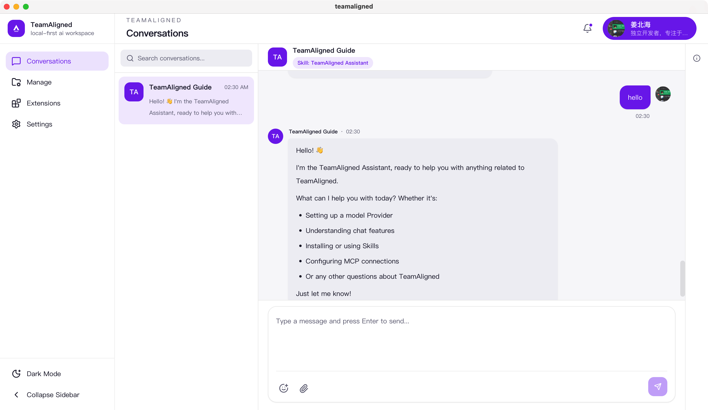

# teamaligned

[中文 README](./README.zh-CN.md)

`teamaligned` is a local-first AI collaboration desktop app.

It is designed to feel like natural chat software: talk to one Agent in direct chat, or collaborate with a group of Agents, while keeping execution local, auditable, and extensible.

## Overview



## Stack

- Desktop: Electron
- Frontend: React + Vite + Tailwind CSS
- Runtime: Node.js 22+ + TypeScript
- Agent orchestration: DeepAgents + LangChain + LangGraph
- Local data: SQLite + Drizzle + better-sqlite3
- Local capabilities: filesystem, shell, search, MCP, Skills
- Providers: OpenAI + Qwen (DashScope)

## Repository

- `apps/desktop`: desktop app (Electron + React)
- `packages/agent-runtime`: local runtime, run control, tools, persistence
- `packages/shared`: shared types/protocols/default seeds
- `docs`: product, architecture, runtime, UX, and beta docs

## Docs

- English docs index: [`docs/en/README.md`](./docs/en/README.md)
- 中文文档索引: [`docs/README.md`](./docs/README.md)
- Changelog: [`CHANGELOG.md`](./CHANGELOG.md)

## Development

```bash
npm install
npm run dev
```

Optional checks:

```bash
npm run typecheck
npm run lint
npm run test:smoke
npm run beta:check
npm run build
npm run db:generate
npm run db:migrate
```
