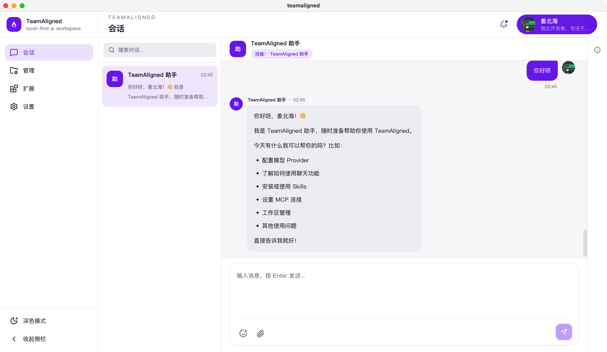

# teamaligned

[English README](./README.md)

`teamaligned` 是一个本地优先的 AI 协作桌面应用。

它的目标是让协作体验更像聊天软件：你可以和单个 Agent 私聊，也可以和多个 Agent 群聊；同时保留本地执行、可审计、可扩展的能力。

## 应用预览



## 技术栈

- 桌面端：Electron
- 前端：React + Vite + Tailwind CSS
- 运行时：Node.js 22+ + TypeScript
- Agent 编排：DeepAgents + LangChain + LangGraph
- 本地数据层：SQLite + Drizzle + better-sqlite3
- 本地能力：文件系统、终端、搜索、MCP、Skills
- 模型供应商：OpenAI + Qwen（DashScope）

## 仓库结构

- `apps/desktop`：桌面应用（Electron + React）
- `packages/agent-runtime`：本地 runtime、运行控制、工具层、持久化
- `packages/shared`：共享类型、协议与默认种子数据
- `docs`：产品、架构、运行时、体验与 beta 文档

## 文档入口

- English 文档索引：[`docs/en/README.md`](./docs/en/README.md)
- 中文文档索引：[`docs/README.md`](./docs/README.md)
- 更新日志：[`CHANGELOG.zh-CN.md`](./CHANGELOG.zh-CN.md)

## 本地开发

```bash
npm install
npm run dev
```

可选检查：

```bash
npm run typecheck
npm run lint
npm run test:smoke
npm run beta:check
npm run build
npm run db:generate
npm run db:migrate
```
