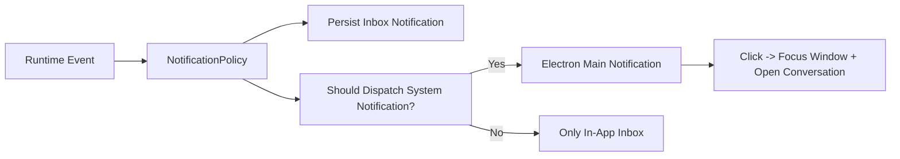

# 通知方案设计

更新时间：2026-04-09

## 目标

在 beta 阶段，`teamaligned` 的通知要解决两件事：

1. 让用户在应用内能看到重要事件
2. 在用户没有盯着当前会话时，真正通过系统通知提醒用户

这套方案不追求“通知越多越好”，而是追求：

- 触发时机明确
- 设置开关即时生效
- 不重复打扰
- 点击通知后能回到正确的会话

## 当前实现状态

当前代码里已经有两层通知能力：

- **应用内通知中心**
- **真正的 Electron 系统通知**

### 已有能力

- runtime 会在多个事件点调用 `createNotification(...)`
- 通知会持久化到 SQLite `notifications` 表
- 右上角铃铛会展示通知中心
- Electron main process 会根据前台状态和设置项决定是否发送系统通知
- 点击系统通知后会聚焦主窗口，并打开对应会话
- 设置页已经有 3 个通知开关：
  - `notifyAgentComplete`
  - `notifyMention`
  - `notifyGroup`

说明：

- 当前内部字段名仍然是 `notifyAgentComplete`
- 但产品层文案建议统一表达为“Agent 消息”
- 这样可以避免现在就为字段重命名做迁移

### 当前仍需验证的部分

- 前台 / 后台 / 最小化三种状态下的触发是否完全符合预期
- 单聊、群聊、@提及三类消息是否都走到了正确的系统通知分类
- 点击系统通知后是否总能回到正确会话

一句话说：

**当前系统通知主链路已实现，后续重点是测试与体验确认。**

## 通知分层

我建议把通知分成两层，而不是混成一个概念。

### 1. 应用内通知中心

作用：

- 作为本地持久化 inbox
- 用来回顾最近发生的事件
- 不要求每条都打扰用户

这层可以保留更多事件，例如：

- run 完成
- run 失败
- mention
- 群组消息
- Skill / MCP 安装与连接结果
- 其他系统提醒

### 2. 系统通知

作用：

- 当用户不在当前会话里时，主动把“需要注意的事”弹到系统层

这层要更克制，beta 阶段建议只支持三类：

- Agent 消息
- 群组里 `@用户`
- 群组新消息

不建议默认把这些打到系统通知：

- Skill 安装成功
- MCP catalog 同步成功
- 扩展连接检测成功
- 普通系统状态提示

这些保留在应用内通知中心就够了。

## 设置项如何生效

当前设置页已有三个开关，这里建议明确其语义。

### `notifyAgentComplete`（产品文案：Agent 消息）

控制：

- 单聊 Agent 的新回复
- 单聊 Agent run 失败
- 后续也可覆盖用户主动发起的后台任务状态更新

建议规则：

- 应用在前台时，不弹系统通知
- 应用失焦或最小化时，再根据开关决定是否提醒
- 无论是否弹系统通知，都写入通知中心

### `notifyMention`

控制：

- 群组消息中明确 `@用户`
- Agent 直接向用户提问
- 群组代为转达的确认问题

建议规则：

- mention 是高优先级提醒
- 只要应用不在前台，就应该弹系统通知
- 同时写入通知中心

### `notifyGroup`

控制：

- 群组对话中的公开新消息
- 但不包含 mention，因为 mention 已由 `notifyMention` 单独控制

建议规则：

- 如果应用失焦或最小化，则允许系统通知
- 如果应用在前台，则不触发系统通知，只保留铃铛和未读提醒

## 设置生效原则

三个开关应满足以下原则：

- 修改后立即生效
- 只影响**之后的新事件**
- 不回溯删除已有通知记录
- 不影响聊天页内的 inline 状态反馈

也就是说：

- 关闭某项通知后，未来不再弹对应系统通知
- 已经存在于通知中心的数据仍然保留

## 推荐的通知策略

当前实现已经采用了 runtime + main process 的通知策略分层。

## 事件到通知的映射

### A. Agent run 完成

- inbox：是
- system：取决于 `notifyAgentComplete`
- 点击后行为：打开对应会话，定位到最新 run

### B. Agent run 失败

- inbox：是
- system：取决于 `notifyAgentComplete`
- 优先级：高于普通完成通知
- 点击后行为：打开对应会话，展开 run 详情

### A / B 的产品表达

虽然底层事件可能仍然区分“完成”和“失败”，但在设置页和通知策略层，建议都归到同一个用户可理解的类别：

- `Agent 消息`

这样更符合聊天产品心智，也更容易让用户理解：

- 这是 Agent 发给我的重要更新
- 而不是一个偏系统化的任务状态开关

### C. 群组 `@用户`

- inbox：是
- system：取决于 `notifyMention`
- 点击后行为：打开对应群组会话

### D. 群组公开新消息

- inbox：是
- system：取决于 `notifyGroup`
- 只在应用失焦或最小化时触发系统通知

### E. Skill / MCP / 扩展事件

- inbox：是
- system：否

### F. 普通系统提示

- inbox：是
- system：否

## 何时不应该弹系统通知

为了避免“应用就在眼前，还被系统通知打断”，建议增加 suppression 规则。

### 不弹的场景

- 应用窗口在前台
- 事件只是普通状态更新，不需要用户立即响应

### 可以弹的场景

- 应用失焦
- 应用最小化
- 当前事件是 mention / run failed 这类强提醒

beta 阶段固定一条全局规则：

- **只要应用在前台，任何系统通知都不触发**

这样可以保证：

- 前台使用时，提醒统一通过当前页面、未读和通知中心承载
- 系统通知只用于用户已经离开应用时的外部提醒

## 技术实现建议

## 1. 运行时层

不要在各处直接“顺手创建通知”后就结束。

建议新增统一入口，例如：

- `emitAppNotification(event)`

这个入口负责：

- 规范化通知类型
- 先写入 inbox
- 再根据设置和前台状态决定是否发系统通知

这样比在多个 `createNotification(...)` 调用点里散落判断更稳定。

## 2. 主进程系统通知

系统通知应统一在 Electron main process 中发送。

建议使用 Electron 官方 `Notification` API：

- `Notification.isSupported()`
- `new Notification({ title, body }).show()`

官方文档：

- [Electron Notification API](https://www.electronjs.org/zh/docs/latest/api/notification)
- [Electron Notifications Tutorial](https://www.electronjs.org/zh/docs/latest/tutorial/notifications)

### 点击系统通知后的行为

系统通知 click 后建议执行：

1. 聚焦主窗口
2. 如果窗口隐藏则显示窗口
3. 打开对应 conversation
4. 可选：高亮相关 run / 消息

## 3. 渲染层状态

渲染层需要向 main process 提供一个最小的“前台可见状态”：

- 当前窗口是否聚焦
- 当前是否最小化
- 当前打开的是哪个 conversation

主进程或 runtime 只要知道这三个信息，就能做出足够好的 beta 通知决策。

## 4. 持久层建议

当前 `NotificationRecord` 结构已经够保存 inbox：

- `type`
- `title`
- `body`
- `read`
- `relatedConversationId`
- `relatedRunId`

beta 阶段可以先不扩表。

如果后面想做得更精细，可以再增加：

- `systemDispatchedAt`
- `deliveryState`
- `dedupeKey`

但这不是第一步必须要做的。

## 系统通知具体体验

### 通知文案建议

文案要短，标题明确，正文只说关键信息。

例如：

- 标题：`Nova 已完成任务`
- 正文：`图表分析结果已经生成，点击查看。`

- 标题：`你被 @ 了`
- 正文：`测试开发群 正在等待你确认截图内容。`

- 标题：`产品开发组 执行失败`
- 正文：`命令退出码为 2，点击查看详情。`

### 不建议的文案

- 太长的技术堆栈信息
- 原始异常堆栈
- 连续多个相似成功消息刷屏

## 平台说明

### macOS

- Electron 主进程通知可以正常使用
- 应注意正文长度，不宜过长

### Windows

- 正式打包后体验更稳定
- 开发环境下可能需要设置 AppUserModelId 才容易看到通知

### Linux

- 依赖桌面环境的通知支持
- beta 阶段可以先按“支持但不保证完全一致”处理

## Beta 阶段建议实现顺序

### 第一步

验证真正的系统通知主链路：

- 运行时事件
- 通知策略判断
- main process `Notification.show()`
- 点击通知回到会话

### 第二步

验证设置开关是否正确参与通知策略：

- `notifyAgentComplete`（UI 文案显示为“Agent 消息”）
- `notifyMention`
- `notifyGroup`

### 第三步

验证 suppression：

- 应用前台时不打任何系统通知
- 应用失焦或最小化时再提醒

### 第四步

补通知测试矩阵：

- 单聊完成
- 单聊失败
- 群组 mention
- 群组普通消息
- 设置开关关闭
- 应用前台 / 后台 / 最小化

## 本阶段的实现边界

beta 阶段建议先不做：

- 系统通知按钮动作
- 通知回复输入框
- 通知分组聚合
- 推送通知 / APNS / FCM
- OAuth 型远端通知服务

## 结论

下一阶段真正要做的，不是“把更多事件写入 notifications 表”，而是把下面这条链路做完整：

- 事件发生
- 设置生效
- 前台状态判断
- 写入通知中心
- 必要时弹系统通知
- 点击后回到对应会话

如果这条链路跑通，`teamaligned` 的通知就会从“本地 inbox”变成真正可用的桌面应用通知系统。
